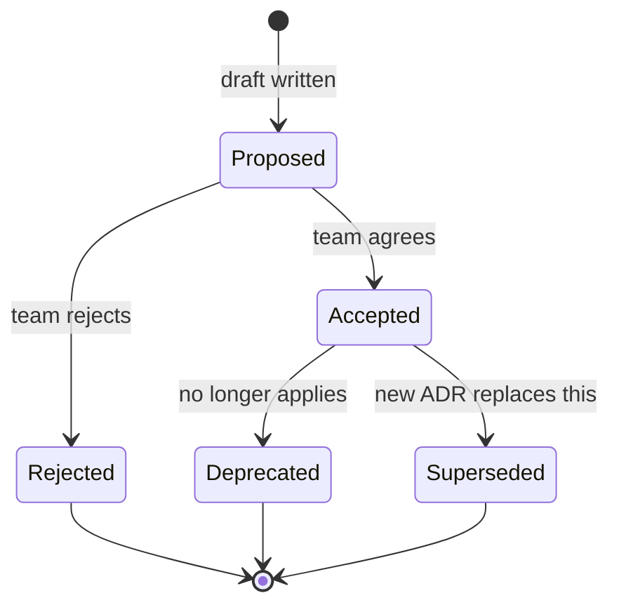

# ADR (Architecture Decision Record) Format

ADRs capture WHY architectural decisions were made. Diagrams show WHAT. You need both — diagrams without ADRs rot in 6 months when no one remembers why.

## When to write an ADR

| Situation | Write ADR? |
|---|---|
| Decision affects 2+ services | YES |
| Decision is hard to reverse (>1 week to change) | YES |
| Decision rejects an obvious alternative | YES |
| Decision sets a precedent for future decisions | YES |
| Local implementation detail in one service | NO (PRD is enough) |
| Library version bump | NO |
| Coding style | NO |

When in doubt: if you'd want to read it in 6 months, write it.

## Template

The canonical, copy-paste template lives at
[`docs/GENERAL/how-to/adr-template.md`](../../../docs/GENERAL/how-to/adr-template.md).
Every ADR MUST start with the YAML frontmatter block below (machine-readable
metadata), then the prose sections. `status` in frontmatter is the single source
of truth and MUST equal the lifecycle folder name.

```markdown
---
id: ADR-NNN
title: "<Title that states the decision>"
status: backlog            # backlog|in-work|in-review|accepted|done|rejected|superseded
phase: PHASE-00            # or GENERAL for cross-phase
owner:                     # accountable person (one)
authors: []               # who works on the ADR
created:                   # YYYY-MM-DD
decided:                   # YYYY-MM-DD when decided
approved_by:               # who approved
approved_at:               # YYYY-MM-DD
supersedes:                # ADR-XXX if it replaces one
superseded_by:             # ADR-XXX if replaced
services: []               # services the decision crosses
related: []                # ADR-XXX / PRD-... / CONCERN-...
tracker_ref:               # ClickUp page_id (set by sync; do not edit by hand)
---

# ADR-NNN: <Title that states the decision>

## Status

<prose status + date>, e.g. `Принято (2026-06-05) — in-review`.

## Context

What is the issue we're seeing that's motivating this decision? What forces are at play?

Be specific:
- Business constraint: "MVP must ship in 8 weeks"
- Technical constraint: "Team has no Kafka experience"
- Scale fact: "Current load is 100 req/s, peaks at 500"
- Past pain: "Previous design had race conditions on user_xp updates"

3-5 paragraphs. Make a future reader understand the world you were in.

## Decision

In a single sentence: what did we decide?

Then 1-2 paragraphs explaining the decision concretely. Be specific enough that someone can implement it.

Example: "We will use HTTPX direct calls for service-to-service communication in MVP. Each caller is responsible for retry (3x exponential backoff) and timeout (5s). Failure mode is to return 503 to upstream and log error. No outbox pattern, no message queue infrastructure."

## Options considered

For each option (minimum 2, ideally 3-4):

### Option A: <name>
- **Description**: ...
- **Pros**: ...
- **Cons**: ...
- **Rejected because**: <specific reason>

### Option B: <name>
- **Description**: ...
- **Pros**: ...
- **Cons**: ...
- **Selected because**: <specific reason>

### Option C: <name>
- **Description**: ...
- **Pros**: ...
- **Cons**: ...
- **Rejected because**: ...

If you can only think of one option — STOP. There's always at least one alternative (often "do nothing"). Find it.

## Consequences

### What becomes easier
- ...
- ...

### What becomes harder
- ...
- ...

### What new risks did we accept
- ...

### What we're explicitly NOT solving (yet)
- ...

This section is required. If you can't list what becomes harder, you haven't fully understood the trade-off.

## Reversal cost

How hard would it be to undo this if we needed to?

- **Easy** (1-2 days): can swap implementation without changing contracts
- **Medium** (1-2 weeks): requires data migration or contract changes
- **Hard** (1+ months): requires service redesign, customer-visible changes
- **Practically irreversible**: would require rewrite

If reversal cost is "Hard" or "Practically irreversible", justify the confidence:
- What evidence supports this being the right long-term call?
- What signal would trigger reconsideration?

## Related

- **Supersedes**: ADR YYYY-MM-DD-<slug> (if applicable)
- **Related ADRs**: ADR YYYY-MM-DD-... (if applicable)
- **Diagram impact**: which architecture diagrams reflect this decision
- **Code locations**: which files/services implement this

## Notes (optional)

Anything else worth recording:
- Off-the-record discussion points
- Hunches that led to the decision
- Things that turned out matter that we didn't expect
```

## Naming convention

Filename: `ADR-NNN-<short-slug>.md`, where NNN is a sequential number within the
phase (zero-padded to 3 digits).

Examples:
- `ADR-005-phase0-service-communication.md`
- `ADR-006-training-service-split.md`
- `ADR-007-gamification-avatar-ownership.md`

Slug is kebab-case, 2-5 words, describes the decision. The `id` in frontmatter
matches the filename prefix (`ADR-NNN`).

## Status lifecycle



**Rules**:
- Never delete an ADR (even Rejected ones — they're history)
- When superseding: new ADR explicitly links back, old ADR status → Superseded
- Deprecated = "we'd decide differently today but it's still in code somewhere"
- Superseded = "explicitly replaced by ADR YYYY-MM-DD"

## Forbidden patterns

- ❌ ADR with one option (that's not a decision, that's an announcement)
- ❌ ADR without "What becomes harder" (you're hiding the trade-off)
- ❌ Vague consequences ("more scalable") — be concrete
- ❌ Generic best-practice citations ("microservices are the modern way")
- ❌ ADR for non-architectural decisions (library upgrade, lint config)
- ❌ Editing accepted ADR — write a new one that supersedes
- ❌ ADR longer than 2 pages — split into multiple or be more concise
- ❌ ADR without date — temporal context is critical

## When AI writes an ADR

Triggered by `/write-architecture` or manually during grilling:

> **Where ADRs live (phase-aware resolution)**: ADRs live under `docs/`, organized
> by phase and lifecycle status.
> - Phase-scoped decision → `docs/<PHASE-NN>/ADRs/<status>/`. The active phase is
>   the canonical marker in `docs/ROADMAP/STATUS.md` (`current: PHASE-NN`) — never
>   hardcode the phase, resolve it from STATUS.md.
> - Cross-phase / platform-wide decision → `docs/GENERAL/ADRs/<status>/`.
> - `<status>` is the lifecycle folder (`backlog/in-work/in-review/done/rejected`)
>   and MUST match the `status:` frontmatter field.

1. Identify the decision being captured
2. Check `docs/<PHASE-NN>/ADRs/` (and `docs/GENERAL/ADRs/` for cross-phase) for existing ADRs that touch the same area
3. If existing ADR contradicts new decision — supersede it (set `superseded_by`/`supersedes`, don't silently override)
4. Fill the frontmatter (id, status, owner, services, related, ...) AND the template:
   - Context: what was the world like?
   - Options: minimum 2, named with pros/cons
   - Decision: what we chose, in one sentence + paragraph
   - Consequences: both directions (easier AND harder)
5. Reversal cost: be honest, not optimistic
6. Cross-link to diagrams, code, related ADRs
7. Save as `docs/<PHASE-NN>/ADRs/<status>/ADR-NNN-<slug>.md` (or `docs/GENERAL/ADRs/<status>/` if it spans phases)

## Example (filled)

```markdown
# ADR 2026-05-09: HTTPX-direct transport between services in MVP

> **Status**: Accepted
> **Date**: 2026-05-09
> **Deciders**: Daniil (solo)
> **Tags**: transport, mvp-scope

## Context

The Alvion backend has 7 active services in MVP (medical, connector, ai, gateway, geo, notification, payment). They need to communicate.

Constraints:
- Team size: 1 (solo dev + AI)
- Timeline: MVP ship target in 8 weeks
- Current scale: 0 users, expecting <1000 in first 6 months
- No Kafka operational experience
- Current infra: docker-compose locally, planning fly.io/Render for first deploy

Past pain (Phase 0 attempt with Kafka): debugging async flows took 3x longer than expected for issues that didn't actually need async.

## Decision

We use HTTPX direct synchronous calls for all service-to-service communication in MVP. Each caller implements:
- Retry: 3x with exponential backoff (100ms, 400ms, 1600ms)
- Timeout: 5 seconds per attempt
- Circuit breaker: opens after 5 consecutive failures, half-opens after 30 seconds

Failure handling:
- On unrecoverable failure: return 503 to upstream
- Log error with correlation ID
- No outbox pattern, no queue

## Options considered

### Option A: HTTPX direct (selected)
- **Pros**: simplest, debuggable, fast iteration, no infrastructure
- **Cons**: cascade failures possible, no async backpressure, tight coupling on latency
- **Selected because**: matches MVP scale and team size; failure modes are acceptable at <1000 users

### Option B: Kafka events
- **Pros**: decoupled, audit trail, async backpressure
- **Cons**: operational complexity, debugging harder, team has no experience
- **Rejected because**: premature for current scale; 3 weeks of operational setup we don't have

### Option C: Outbox pattern (Postgres → relay)
- **Pros**: reliability without Kafka, sticks with existing infra
- **Cons**: more code to maintain, eventual consistency complexity
- **Rejected because**: adds complexity for problem we don't yet have

## Consequences

### What becomes easier
- Local development: just run services, no Kafka container needed
- Debugging: stack traces span services via correlation ID
- Onboarding: standard HTTP everywhere, no DSL to learn

### What becomes harder
- High-load future: HTTPX will hit limits before async would
- Long-running operations: must use polling or webhooks (no native queue)
- Cross-service transactions: each caller handles its own consistency

### Risks accepted
- Cascade failures: if medical-service is slow, callers slow down too
- Tight latency coupling: every hop adds to user-facing latency
- No replay: failed events not preserved (must rely on user retry)

### Not solving yet
- Long-running batch operations (will revisit if needed)
- Cross-region replication
- Multi-tenant isolation at queue level

## Reversal cost

**Medium**. To switch to Kafka:
- Identify hot paths (ingest, AI calls)
- Add publisher in caller services
- Add consumer in callee services
- Maintain dual paths during migration
- Estimate: 2-3 weeks for full migration

Signal to reconsider: sustained >1000 req/s OR cascade failure incident in production.

## Related

- Diagram impact: `docs/current/architecture/container-diagram.md` shows HTTPX edges
- Future ADR (if revised): `transport-strategy-v2.md`
```

## Audit checklist for existing ADRs

When reviewing ADRs (in `/architecture-review`):
- [ ] YAML frontmatter present; `status:` matches the lifecycle folder name
- [ ] `id` matches filename prefix; `owner`/`services` filled
- [ ] At least 2 options considered
- [ ] Both "easier" and "harder" consequences listed
- [ ] Reversal cost stated
- [ ] Cross-links to diagrams/code where applicable
- [ ] No "we just decided" without reasoning
