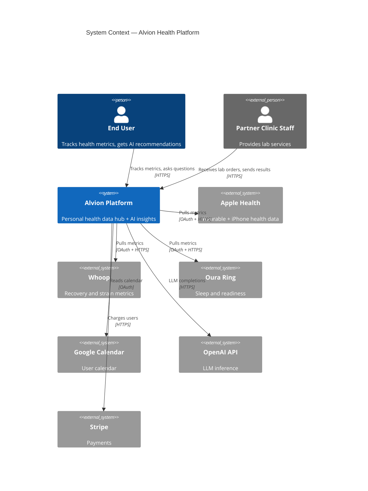
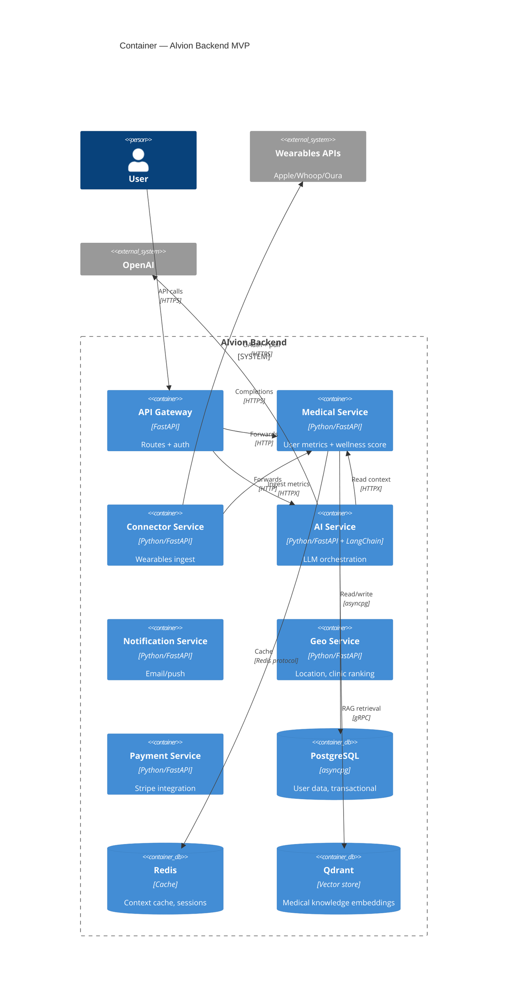
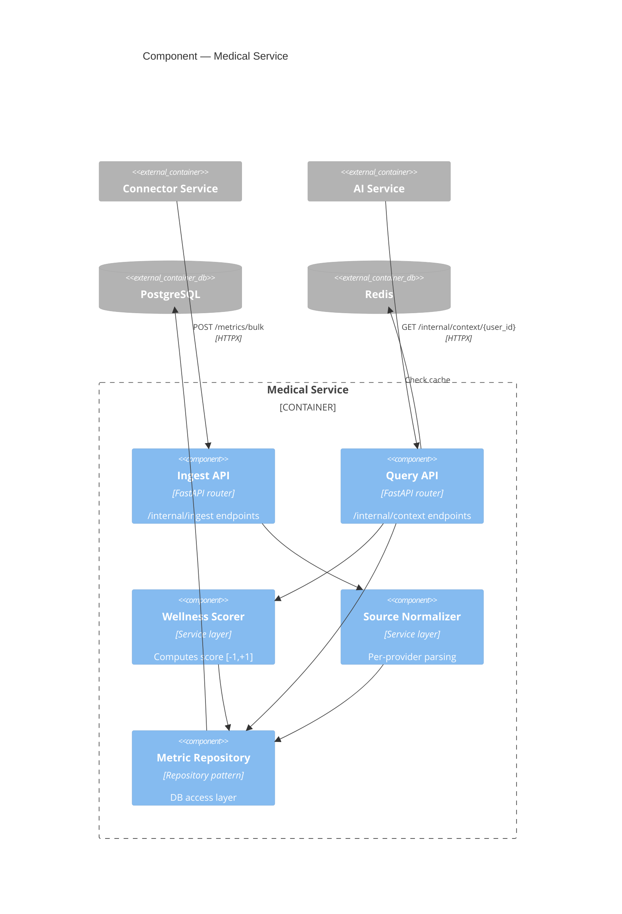
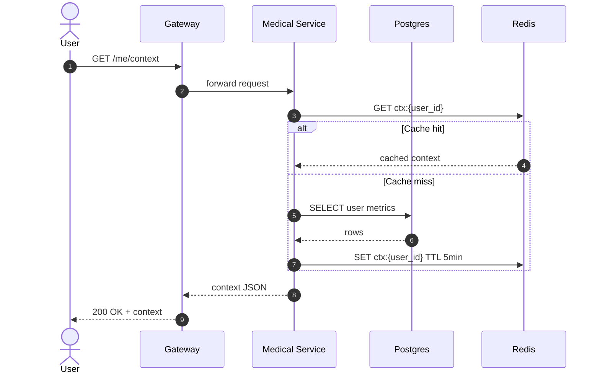

# C4 Diagrams (Mermaid)

Architecture diagrams in this project follow the **C4 model**. Mermaid supports C4 natively — do NOT use generic `flowchart` syntax for architecture views.

## Four levels

| Level | Name | What's shown | Audience |
|---|---|---|---|
| 1 | System Context | Our system + external actors + external systems | Anyone |
| 2 | Container | Services, databases, queues, gateways | Developers, ops |
| 3 | Component | Inside one container | Developers of that service |
| 4 | Code | Class diagrams | Implementers (rarely useful) |

Don't draw L4 unless absolutely necessary. Don't mix levels in one diagram.

## L1 — System Context

Show our system as ONE box, with all external actors and systems around it. NO internal services visible.



## L2 — Container

Show services, databases, queues. NO classes, NO functions, NO internals of services.



## L3 — Component

Show INSIDE one container. Only one service per diagram.



## C4 element types

### People / Systems

```
Person(alias, "Label", "Description")              # internal user
Person_Ext(alias, "Label", "Description")          # external user

System(alias, "Label", "Description")              # our system (L1 only)
System_Ext(alias, "Label", "Description")          # external system

System_Boundary(alias, "Label") { ... }            # group of containers
```

### Containers (L2)

```
Container(alias, "Label", "Tech", "Description")
ContainerDb(alias, "Label", "Tech", "Description")     # for databases
ContainerQueue(alias, "Label", "Tech", "Description")  # for queues

Container_Ext(...)     # external container (when viewing one service)
ContainerDb_Ext(...)
```

### Components (L3)

```
Component(alias, "Label", "Tech", "Description")
ComponentDb(alias, "Label", "Tech", "Description")
```

### Relationships

```
Rel(from, to, "Label", "Tech")          # solid arrow
Rel_Back(from, to, "Label")             # backwards relationship
BiRel(a, b, "Label", "Tech")            # bidirectional
```

Arrow position can be controlled with directional variants:
```
Rel_Up(from, to, "...")
Rel_Down(from, to, "...")
Rel_Left(from, to, "...")
Rel_Right(from, to, "...")
```

## Sequence diagrams (for data-flow/)

For request flows, use Mermaid `sequenceDiagram` (not C4):



## Forbidden patterns

- ❌ Generic `flowchart TD` for architecture (use C4 syntax)
- ❌ Mixing levels: `Container` and `Component` in same diagram
- ❌ Showing database internals at L2 (that's L3+)
- ❌ Boxes with technology names only ("PostgreSQL") without capability ("User data store")
- ❌ Arrows without labels (you must label what flows)
- ❌ More than ~15 elements in a single diagram (split it)
- ❌ Bidirectional arrows where direction matters (use two `Rel`)

## When to use which type

| Need | Diagram type |
|---|---|
| Show external integrations | `C4Context` |
| Show all our services | `C4Container` |
| Show inside one service | `C4Component` |
| Show a request flow over time | `sequenceDiagram` |
| Show entity relationships | `erDiagram` |
| Show state transitions | `stateDiagram-v2` |
| Show deployment topology | `C4Deployment` (advanced) |
| Show generic process flow (non-arch) | `flowchart` |

## Naming conventions

- Service aliases: lowercase, no hyphens (`medical` not `medical-service` in alias; but label is `"Medical Service"`)
- Labels in quotes use proper noun casing: `"Medical Service"`, not `"medical service"`
- Tech tag is short and concrete: `"FastAPI"`, `"asyncpg"`, `"Redis 7"`
- Description tag is one sentence about capability
