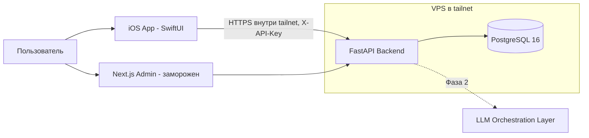

# PHASE-01: Обзор системы

## Контекст (C4 L1)

Один пользователь, три клиента, один сервер.



- Весь трафик iPhone ↔ VPS идёт через Tailscale (WireGuard). Порты API наружу не публикуются.
- Второй рубеж — статический `X-API-Key` (env на сервере, Keychain на устройстве).

## Контейнеры (C4 L2)

| Контейнер | Технологии | Ответственность |
|-----------|-----------|-----------------|
| iOS App | SwiftUI, iOS 17+, SwiftData, URLSession | Все пользовательские сценарии: быстрый ввод, таблица, CRUD категорий/записей/журнала, дашборд, настройки |
| Backend API | FastAPI, SQLAlchemy 2.0 async, Alembic | Домены category/field/entry/journal + табличная агрегация + auth dependency |
| БД | PostgreSQL 16 (docker volume + ежедневный pg_dump) | Источник истины |
| Web Admin | Next.js (заморожен) | Отладка и массовое редактирование с ноутбука |
| LLM Orchestration | (Фаза 2) отдельный слой, LangChain | Инсайты по данным; бизнес-сервисы не зовут LLM напрямую |

## Слои iOS-приложения

```
Features/  — экраны (Today, Table, Categories, Entries, Journal, Dashboard, Settings)
Domain/    — модели и логика агрегации/отображения
API/       — HTTP-клиент, DTO (Codable), маппинг ошибок
Cache/     — SwiftData: read-кэш последних ответов + очередь исходящих записей
```

Поток данных: Feature → API (online) → обновить Cache → UI. При офлайне: Feature → Cache (чтение) / очередь (запись). Очередь флашится при восстановлении сети (NWPathMonitor).

## Ключевые решения

Полные тексты — в `docs/PHASE-01/ADRs/done/`:

- ADR-0001 — переиспользуем существующий FastAPI-бэкенд, не переписываем.
- ADR-0002 — online-first + read-кэш + очередь записей вместо полного offline-first.
- ADR-0003 — периметр Tailscale + статический API-ключ вместо JWT/юзеров.

## Табличное представление

`GET /api/v1/table?date_from&date_to` → на каждую дату строка, на каждую категорию колонка. Агрегация за день на бэкенде: number → sum, boolean → any, text/select/date → last. Клиенты агрегацию не считают — единая логика для iOS и веба.

## Нефункциональные требования

- Масштаб: один пользователь, десятки записей в день, годы истории — никакой оптимизации преждевременно не делаем; индекса по `entry.date` достаточно.
- Надёжность данных: ежедневный `pg_dump` в отдельную директорию VPS (+желательно off-site copy).
- Безопасность: никакого PII в логах; ключ не логируется.
